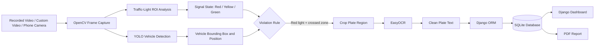

# AI-Powered Traffic Light Violation Detection System

<p align="center">
  <strong>Computer-vision traffic monitoring with vehicle detection, red-light violation identification, number-plate OCR, a Django dashboard, SQLite storage, and PDF reporting.</strong>
</p>

<p align="center">
  
  
  
  
  
  
</p>

---

## Table of Contents

- [Overview](#overview)
- [Main Features](#main-features)
- [System Workflow](#system-workflow)
- [Architecture](#architecture)
- [Technology Stack](#technology-stack)
- [Repository Structure](#repository-structure)
- [Database Model](#database-model)
- [Installation](#installation)
- [Running the Project](#running-the-project)
- [Video Input Options](#video-input-options)
- [Web Routes](#web-routes)
- [Detection Logic](#detection-logic)
- [Important Configuration](#important-configuration)
- [Troubleshooting](#troubleshooting)
- [Current Limitations](#current-limitations)
- [Security and Production Notes](#security-and-production-notes)
- [Future Improvements](#future-improvements)
- [Project Team](#project-team)
- [Disclaimer](#disclaimer)
- [License](#license)

---

## Overview

This repository contains an academic **Smart Traffic Violation Detection System** that processes traffic video and identifies vehicles crossing a defined violation zone while the traffic signal is red.

The system combines:

- **Ultralytics YOLO** for vehicle detection
- **OpenCV** for video processing and traffic-light colour analysis
- **EasyOCR** for number-plate text extraction
- **Django** for the web dashboard and application logic
- **SQLite** for violation record storage
- **xhtml2pdf** for downloadable traffic violation reports

When a violation is detected, the application attempts to read the number plate, records the vehicle type, assigns a fine, stores the event in the database, and displays it on a dashboard.

> **Project status:** This is an academic prototype. It is suitable for demonstrations, experimentation, and further research, but it is not yet ready for real-world traffic enforcement.

---

## Main Features

### AI and Computer Vision

- Detects common road vehicles from video frames
- Processes cars, motorcycles, buses, and trucks
- Detects red, yellow, and green traffic-light states
- Uses configurable stop-line and violation-zone coordinates
- Marks vehicles as:
  - `NORMAL`
  - `APPROACHING`
  - `OK`
  - `VIOLATION`
- Displays live bounding boxes and signal status
- Supports recorded videos, custom video files, and a network camera stream

### Number-Plate Processing

- Crops the lower portion of a detected vehicle
- Runs OCR using EasyOCR
- Removes non-alphanumeric characters from detected text
- Falls back to `UNKNOWN` when OCR confidence or text quality is insufficient

### Violation Management

- Saves violations through the Django ORM
- Stores:
  - Number plate
  - Vehicle type
  - Detection timestamp
  - Fine amount
  - Optional image-evidence path
- Uses a default fine amount of **Rs. 500**
- Avoids inserting an identical plate and vehicle-type combination more than once

### Web Dashboard

- Displays the total number of violations
- Displays the total value of recorded fines
- Shows recent violations in descending time order
- Refreshes automatically every three seconds
- Provides vehicle, plate, timestamp, and fine information
- Includes a downloadable PDF report

---

## System Workflow

1. A video source is opened using OpenCV.
2. Each frame is resized to `1280 × 720`.
3. A fixed region of interest is analysed to determine the signal colour.
4. YOLO detects supported vehicle classes.
5. The bottom-centre point of every vehicle is calculated.
6. The point is compared with the configured stop line and violation zone.
7. A violation is recorded only when:
   - The vehicle has crossed the violation-zone line, and
   - The detected signal colour is red.
8. The lower portion of the vehicle is sent to EasyOCR.
9. The plate number, vehicle type, timestamp, and fine are stored in SQLite.
10. The Django dashboard reads and displays the stored records.
11. Users can export a PDF report from the dashboard.

---

## Architecture



### Main Components

| Component | Responsibility |
|---|---|
| `engine.py` | Video processing, traffic-light analysis, YOLO inference, OCR, and database insertion |
| `monitor/models.py` | Defines the database structure for violation records |
| `monitor/views.py` | Loads dashboard statistics and generates PDF reports |
| `dashboard.html` | Displays totals, status cards, and violation records |
| `pdf_report.html` | Provides the HTML template used to generate PDF reports |
| `traffic_core/settings.py` | Django application, database, timezone, and static-file configuration |
| `traffic_core/urls.py` | Maps dashboard, admin, and PDF-export routes |

---

## Technology Stack

| Category | Technology |
|---|---|
| Programming language | Python |
| Web framework | Django |
| Object detection | Ultralytics YOLO |
| Image/video processing | OpenCV |
| OCR | EasyOCR |
| Numerical processing | NumPy |
| Database | SQLite |
| Frontend | HTML, Django Templates, Tailwind CSS CDN, Font Awesome |
| PDF generation | xhtml2pdf |
| ML runtime | PyTorch / TorchVision |

### Python Version

The pinned Django 6.0 release requires **Python 3.12, 3.13, or 3.14**. Python 3.12 is a practical choice for this repository.

---

## Repository Structure

```text
traffic_light_violator_fyp/
│
├── README.md
├── requirement.txt
├── .gitignore
│
└── SmartTrafficSystem/
    ├── requirements.txt
    ├── .gitignore
    │
    └── traffic_core/
        ├── manage.py
        ├── engine.py
        ├── db.sqlite3
        ├── traffic_video_modified.mp4
        ├── yolo8n.pt
        │
        ├── monitor/
        │   ├── __init__.py
        │   ├── admin.py
        │   ├── apps.py
        │   ├── models.py
        │   ├── tests.py
        │   ├── views.py
        │   │
        │   ├── migrations/
        │   │   ├── __init__.py
        │   │   └── 0001_initial.py
        │   │
        │   └── templates/
        │       └── monitor/
        │           ├── dashboard.html
        │           └── pdf_report.html
        │
        └── traffic_core/
            ├── __init__.py
            ├── asgi.py
            ├── settings.py
            ├── urls.py
            └── wsgi.py
```

---

## Database Model

The `Violation` model stores each recorded event.

| Field | Type | Description |
|---|---|---|
| `plate_number` | `CharField` | OCR result or `UNKNOWN` |
| `vehicle_type` | `CharField` | Detected YOLO vehicle category |
| `timestamp` | `DateTimeField` | Automatically recorded creation time |
| `fine_amount` | `IntegerField` | Fine value; default is Rs. 500 |
| `image_evidence` | `ImageField` | Optional path for a saved evidence image |

The application currently checks whether the same `plate_number` and `vehicle_type` already exist before inserting a new record.

---

## Installation

### 1. Clone the Repository

```bash
git clone https://github.com/Abdullah2139/traffic_light_violator_fyp.git
cd traffic_light_violator_fyp/SmartTrafficSystem
```

### 2. Create a Virtual Environment

#### Windows PowerShell

```powershell
python -m venv .venv
.venv\Scripts\Activate.ps1
```

#### Windows Git Bash

```bash
python -m venv .venv
source .venv/Scripts/activate
```

#### Linux or macOS

```bash
python3 -m venv .venv
source .venv/bin/activate
```

### 3. Upgrade Packaging Tools

```bash
python -m pip install --upgrade pip setuptools wheel
```

### 4. Install Dependencies

```bash
pip install -r requirements.txt
```

The PDF view imports `xhtml2pdf`. Install it separately if it is not already present in the requirements file:

```bash
pip install xhtml2pdf
```

### 5. Move to the Django Project Directory

```bash
cd traffic_core
```

### 6. Apply Database Migrations

```bash
python manage.py makemigrations
python manage.py migrate
```

### 7. Optional: Create an Admin User

```bash
python manage.py createsuperuser
```

Follow the prompts to create a username, email address, and password.

---

## Running the Project

The application has two main processes:

1. The Django dashboard
2. The AI detection engine

Run them in separate terminals while the same virtual environment is active.

### Terminal 1: Start the Django Server

From `SmartTrafficSystem/traffic_core/`:

```bash
python manage.py runserver
```

Open:

```text
http://127.0.0.1:8000/
```

Django administration is available at:

```text
http://127.0.0.1:8000/admin/
```

### Terminal 2: Start the Detection Engine

From the same directory:

```bash
python engine.py
```

The engine presents three choices:

```text
1. Use the included traffic video
2. Use a custom video file
3. Use a wireless phone camera
```

Press `q` inside the OpenCV video window to stop processing.

---

## Video Input Options

### Included Test Video

Choose option `1` to run:

```text
traffic_video_modified.mp4
```

Make sure the video exists in the same folder as `engine.py`.

### Custom Video

Choose option `2` and enter either:

- A relative path
- An absolute path

Windows example:

```text
D:\Videos\traffic_test.mp4
```

Relative-path example:

```text
videos/test_video.mp4
```

### Wireless Phone Camera

The current code contains a fixed network stream:

```python
source = "http://10.135.21.212:8080/video"
```

Replace it with the video URL shown by your phone camera application.

Example:

```python
source = "http://192.168.1.10:8080/video"
```

Requirements:

- The phone and computer must normally be on the same network.
- The stream URL must be accessible from the computer.
- Firewall rules must allow the connection.

---

## Web Routes

| Route | Purpose |
|---|---|
| `/` | Main traffic violation dashboard |
| `/admin/` | Django administration panel |
| `/export_pdf/` | Generates and downloads the traffic report |

---

## Detection Logic

### Traffic-Light Detection

The system selects a region in the upper-right part of each frame:

```python
x1, y1 = int(width * 0.85), int(height * 0.02)
x2, y2 = int(width * 0.98), int(height * 0.18)
```

The selected area is converted from BGR to HSV. Three colour masks are created:

- Red
- Green
- Yellow

The colour with the highest number of matching pixels is returned when it passes the minimum pixel threshold. Otherwise, the result is `UNKNOWN`.

### Vehicle Detection

YOLO inference is restricted to selected COCO vehicle classes:

```python
classes=[2, 3, 5, 7]
```

These represent common road vehicles such as:

- Car
- Motorcycle
- Bus
- Truck

Detections below the configured confidence threshold are ignored:

```python
if confidence < 0.5:
    continue
```

### Stop and Violation Zones

The current stop line and violation zone are calculated from the frame height:

```python
STOP_LINE_Y = int(frame_height * 0.65)
VIOLATION_ZONE_Y = int(frame_height * 0.70)
```

A vehicle's bottom-centre point is used to determine its position.

| Condition | Label |
|---|---|
| Before stop line | `NORMAL` |
| Between stop line and violation zone | `APPROACHING` |
| Past violation zone on green/yellow | `OK` |
| Past violation zone on red | `VIOLATION` |

### OCR Process

For a violating vehicle:

1. The lower 40% of its bounding box is cropped.
2. EasyOCR reads text from the crop.
3. Only alphanumeric characters are retained.
4. Text shorter than three characters is replaced with `UNKNOWN`.
5. The cleaned result is stored in the database.

---

## Important Configuration

Most environment-specific values are currently stored directly in the source code.

### Model File

In `engine.py`:

```python
model = YOLO("yolo8n.pt")
```

The weight file must be available relative to the working directory. A more robust approach is to build an absolute path from `__file__`.

### Detection Confidence

```python
if confidence < 0.5:
    continue
```

Increase the value to reduce weak detections, or decrease it to accept more detections.

### Signal Region of Interest

```python
x1, y1 = int(width * 0.85), int(height * 0.02)
x2, y2 = int(width * 0.98), int(height * 0.18)
```

These values are specific to the included video angle. They must be recalibrated for another camera position.

### Stop-Line Position

```python
STOP_LINE_Y = int(frame_height * 0.65)
```

### Violation-Zone Position

```python
VIOLATION_ZONE_Y = int(frame_height * 0.70)
```

### Fine Amount

In `engine.py`:

```python
fine_amount=500
```

The model also uses `500` as its default value.

### Time Zone

The current Django setting is:

```python
TIME_ZONE = "Asia/Kolkata"
```

For a deployment in Pakistan, use:

```python
TIME_ZONE = "Asia/Karachi"
```

### Dashboard Refresh Rate

The dashboard refreshes every 3,000 milliseconds:

```javascript
setTimeout(function () {
    window.location.reload(1);
}, 3000);
```

---

## Troubleshooting

### `ModuleNotFoundError: No module named 'xhtml2pdf'`

Install the missing package:

```bash
pip install xhtml2pdf
```

### `No module named django`, `cv2`, `easyocr`, or `ultralytics`

Confirm that the virtual environment is activated, then reinstall:

```bash
pip install -r requirements.txt
```

### YOLO Model File Is Not Found

Confirm that this file exists:

```text
SmartTrafficSystem/traffic_core/yolo8n.pt
```

Run `engine.py` from the directory containing the model:

```bash
cd SmartTrafficSystem/traffic_core
python engine.py
```

### Video Cannot Be Opened

Check the path and test it in Python:

```python
import cv2

cap = cv2.VideoCapture("your_video.mp4")
print(cap.isOpened())
```

A result of `False` means OpenCV could not open the source.

### Phone Camera Stream Is Not Working

- Confirm the IP address and port.
- Open the stream URL in a browser.
- Keep the phone-camera server running.
- Confirm both devices are connected to the same network.
- Update the hard-coded URL in `engine.py`.

### Traffic-Light Colour Is Always `UNKNOWN`

The region of interest probably does not contain the traffic light. Update the ROI percentages in `detect_traffic_light_color()`.

You may temporarily display the ROI for calibration:

```python
cv2.imshow("Traffic Light ROI", traffic_light_roi)
```

### No Violations Appear in the Dashboard

Check that:

- Django migrations were applied.
- `engine.py` is using the same Django settings and SQLite database.
- The signal is detected as `RED`.
- A vehicle crosses `VIOLATION_ZONE_Y`.
- The vehicle confidence is at least `0.5`.
- The same plate/vehicle combination does not already exist.

### OCR Frequently Returns `UNKNOWN`

Possible causes include:

- Small number plates
- Motion blur
- Poor lighting
- Incorrect crop area
- Low camera resolution
- Obstructed plates
- Non-English or stylised plate text

Possible improvements include plate-specific detection, perspective correction, image sharpening, thresholding, and multiple OCR attempts.

### OpenCV Window Does Not Appear

The graphical window may not work correctly in:

- Headless servers
- Some remote terminals
- Docker containers without display access
- Environments using only `opencv-python-headless`

For a desktop demonstration, install the normal OpenCV package:

```bash
pip uninstall opencv-python-headless
pip install opencv-python
```

### SQLite Database Is Locked

Do not run multiple processes that continuously write to the same SQLite database at high frequency. For a larger deployment, migrate to PostgreSQL.

---

## Current Limitations

The current repository is a working prototype with several limitations:

1. **Fixed camera geometry**  
   The traffic-light ROI and stop-line locations are calibrated for a specific video angle.

2. **No vehicle tracking**  
   Vehicles are detected independently in each frame. There is no persistent tracking ID.

3. **Basic duplicate handling**  
   Once a plate and vehicle-type combination exists, future violations with the same combination may be skipped permanently.

4. **Approximate plate crop**  
   The system crops the lower part of the vehicle rather than using a dedicated licence-plate detector.

5. **No OCR confidence storage**  
   OCR confidence and alternative text candidates are not saved.

6. **Evidence image not currently populated**  
   The database contains an `image_evidence` field, but the detection engine does not currently save the violating frame into it.

7. **UI action buttons are placeholders**  
   View, mark-as-paid, and delete buttons are displayed but are not connected to backend routes.

8. **Fine status is not stored**  
   The dashboard shows `Unpaid`, but the database model does not currently contain payment-status fields.

9. **Signal detection is colour based**  
   Reflections, weather, low light, and nearby objects with similar colours can affect detection.

10. **No user authentication on the main dashboard**  
    The root dashboard is publicly accessible when the development server is exposed.

11. **SQLite is intended for development**  
    It is not ideal for high-volume, concurrent production workloads.

12. **No automated test suite**  
    The repository contains `tests.py`, but comprehensive unit and integration tests have not yet been implemented.

---

## Security and Production Notes

Before any public or production deployment:

- Move the Django secret key to an environment variable.
- Set `DEBUG = False`.
- Configure `ALLOWED_HOSTS`.
- Use PostgreSQL instead of SQLite.
- Protect dashboard and report routes with authentication.
- Add role-based access control.
- Validate all uploaded file paths and user input.
- Store camera credentials securely.
- Use HTTPS.
- Add structured logging and error monitoring.
- Remove or replace sample database records.
- Review local privacy and surveillance requirements.
- Do not use automatically generated OCR output as the sole basis for legal enforcement.

Suggested environment-variable pattern:

```python
import os

SECRET_KEY = os.environ["DJANGO_SECRET_KEY"]
DEBUG = os.getenv("DJANGO_DEBUG", "False").lower() == "true"
ALLOWED_HOSTS = os.getenv("DJANGO_ALLOWED_HOSTS", "127.0.0.1,localhost").split(",")
```

---

## Future Improvements

Potential improvements for a more reliable traffic-management platform:

- Add ByteTrack or Deep SORT for persistent vehicle tracking
- Use a dedicated licence-plate detector before OCR
- Save full-frame and cropped evidence images
- Store OCR confidence scores
- Add a time-based duplicate cooldown
- Add camera-specific configuration profiles
- Support multiple intersections and camera streams
- Add wrong-way driving detection
- Add illegal-lane and restricted-lane detection
- Add helmet and seat-belt detection
- Add speed estimation using camera calibration
- Add violation review and approval workflow
- Add paid/unpaid fine status
- Add record search, filtering, and pagination
- Add CSV and Excel report exports
- Add user authentication and permissions
- Add REST APIs
- Add PostgreSQL and background workers
- Add Docker support
- Add automated tests and CI/CD
- Add performance metrics and model evaluation
- Add real-time streaming to the browser instead of page refresh
- Move all thresholds and paths into a configuration file
- Add a graphical camera-calibration tool

---

## Suggested Testing Plan

### Unit Tests

Test:

- Traffic-light colour classification
- Plate-text cleaning
- Fine calculation
- Violation model creation
- Dashboard totals
- PDF response generation

### Integration Tests

Test:

- Video frame to YOLO result
- Violation event to database insertion
- Database record to dashboard rendering
- Database records to PDF export

### Model Evaluation

Measure:

- Vehicle-detection precision and recall
- Signal-colour classification accuracy
- Violation-detection accuracy
- OCR character accuracy
- False-positive rate
- False-negative rate
- Processing frames per second
- End-to-end event latency

---

## Project Team

**Final-Year Project — Department of Computer Systems Engineering, UET Peshawar**

| Role | Name |
|---|---|
| Student | Abdullah Khan |
| Student | Khalil Hussain |
| Student | Adnan Khan |
| Supervisor | Dr. Amaad Khalil |

---

## Disclaimer

This repository is intended for **academic, educational, and research purposes**.

Computer-vision detections and OCR results can be incorrect because of camera angle, lighting, weather, motion blur, model limitations, or poor image quality. The software should not be used as the sole basis for issuing legal penalties without human review, proper calibration, security controls, and compliance with applicable laws.

---

## License

No licence file is currently included in this repository.

Until a licence is added, reuse, modification, and redistribution rights are not explicitly granted. Add an appropriate licence such as MIT, Apache-2.0, or a project-specific academic licence before wider distribution.

---

## Repository

**GitHub:** https://github.com/Abdullah2139/traffic_light_violator_fyp

---

<p align="center">
  Developed as a final-year academic project for intelligent traffic monitoring and automated violation analysis.
</p>
